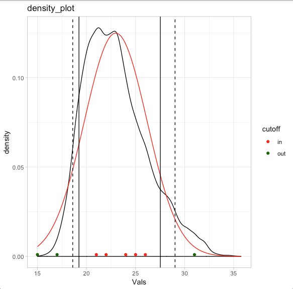
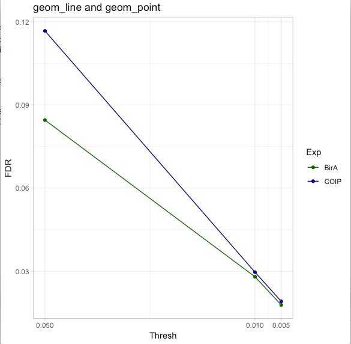
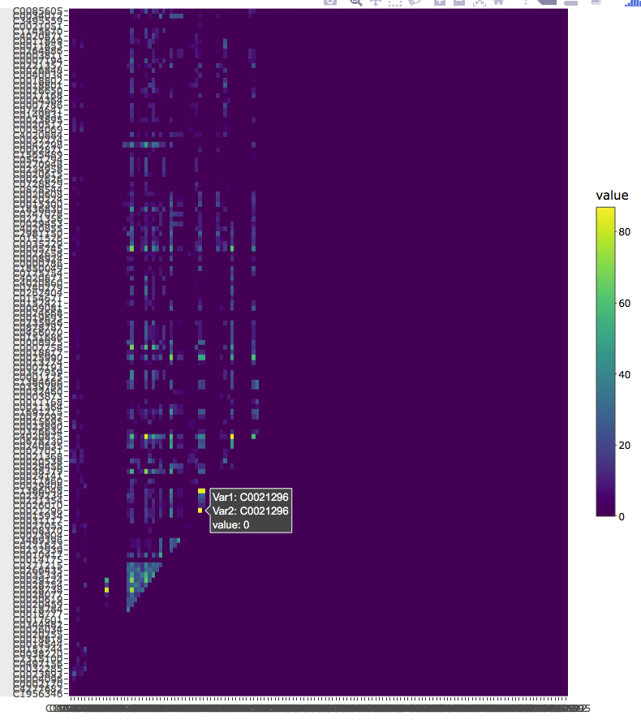

# examples_ggplot

Some plots that I created for own interest that might be usefull for you as well

## norm_density_plot.R script

## geom_line_and_geom_point_FDR_plot.R script

## interactive_blueish_heatmap.R script

